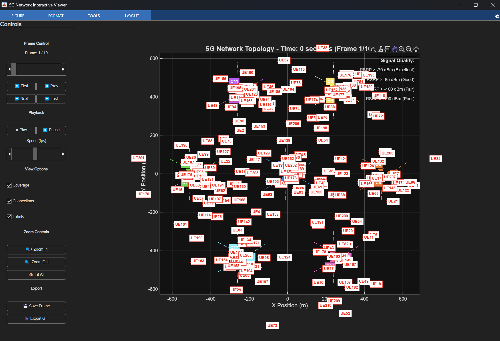

# Báo cáo Kịch bản 3GPP và Ứng dụng trong RL cho Tiết kiệm Năng lượng 5G - Trường hợp yêu cầu tải thấp

## 1. Giới thiệu
Trong nghiên cứu và triển khai các giải pháp tiết kiệm năng lượng (Energy Saving) cho mạng 5G, việc sử dụng **các kịch bản tham chiếu 3GPP (3rd Generation Partnership Project)** là tiêu chuẩn hóa và cần thiết.

Các kịch bản này được định nghĩa để phản ánh những môi trường triển khai mạng phổ biến, bao gồm:
- **Indoor Hotspot (Trong nhà)**
- **Dense Urban (Đô thị)**
- **Rural (Nông thôn)**
- **Urban Macro (Đô thị lớn)**

Các kịch bản này cung cấp thông tin về:
- Số lượng trạm gốc (**Sites**) và ô (**Cells**)
- Khoảng cách giữa các trạm (ISD – Inter-Site Distance)
- Công suất phát tối thiểu và tối đa (**Transmit Power**)
- Mức tiêu thụ năng lượng (**Power Consumption**) cơ bản và khi nhàn rỗi (**Base Power, Idle Power**)
- Tần số sóng mang (**Carrier Frequency**)
- Thời lượng mô phỏng và bước thời gian (**Simulation Time, Time Step**)
- Mật độ và cách phân bổ người dùng (**UEs**)

Điều này cho phép tạo ra dữ liệu **chuẩn hóa và đa dạng** để huấn luyện và đánh giá các thuật toán RL trong việc điều chỉnh công suất phát và trạng thái hoạt động/tắt của các ô, nhằm tiết kiệm năng lượng mà vẫn đảm bảo QoS.

---

## 2. Kịch bản 1: Indoor Hotspot

*Hình 1: Layout trong mô phỏng với 12 ô (cells)*

*Hình 2: Mô tả kịch bản trong 3GPP TR 38.901*

### 2.1 Mô tả tổng quan
**Indoor Hotspot** là kịch bản triển khai mạng trong nhà được tinh chỉnh cho các môi trường như trung tâm thương mại, nhà ga, sân bay trong giờ cao điểm

### 2.2 Thông số kỹ thuật chi tiết

| **Thông số** | **Giá trị** | **Đơn vị** | **Ghi chú** |
|--------------|-------------|------------|-------------|
| **Deployment Scenario** | indoor_hotspot | - | Kịch bản 3GPP |
| **Carrier Frequency** | 4.0 | GHz | Mid-band 5G |
| **System Bandwidth** | 200 | MHz | Băng thông rộng |
| **Layout** | single_layer_indoor | - | Một tầng trong nhà |
| **Inter-Site Distance** | 20 | m | Khoảng cách gần |
| **Number of Sites** | 12 | site | Mật độ cao |
| **Sectors per Site** | 1 | sector | Omnidirectional |
| **Antenna Height** | 3 | m | Trần nhà thấp |
| **Cell Radius** | 15 | m | Coverage nhỏ |

### 2.3 Cấu hình năng lượng và công suất

| **Thông số** | **Giá trị** | **Đơn vị** | **Đặc điểm** |
|--------------|-------------|------------|-------------|
| **Min Tx Power** | 10 | dBm | Công suất tối thiểu |
| **Max Tx Power** | 23 | dBm | Công suất tối đa |
| **Base Power** | 50 | W | Tiêu thụ cơ sở |
| **Idle Power** | 15 | W | Chế độ chờ |

### 2.4 Đặc điểm người dùng và môi trường

| **Thông số** | **Giá trị** | **Đặc điểm** |
|--------------|-------------|-------------|
| **Number of UEs** | 120 | **Tải trung bình**: ~10 UE/cell |
| **User Distribution** | 100% Indoor | Hoàn toàn trong nhà |
| **UE Speed** | 3 km/h | Người đi bộ |
| **Indoor Ratio** | 100% | Toàn bộ indoor |

### 2.5 Thông số mô phỏng (có thể tự điều chỉnh)

| **Thông số** | **Giá trị** | **Mục đích** |
|--------------|-------------|-------------|
| **Simulation Time** | 300 | giây |
| **Time Step** | 1 | giây |
| **Traffic Lambda** | 20 | Tải trung bình |
| **Peak Hour Multiplier** | 1.5 | Hệ số giờ cao điểm |

### 2.6 Ngưỡng QoS và hiệu suất

| **Metric** | **Threshold** | **Đơn vị** | **Đặc điểm** |
|------------|---------------|------------|-----------|
| **RSRP Serving** | -110 | dBm | Công suất phục vụ tối thiểu |
| **RSRP Target** | -100 | dBm | Công suất phục vụ mục tiêu |
| **RSRP Measurement** | -115 | dBm | Công suất đo lường |
| **Drop Call** | 1 | % | Tỷ lệ rớt cuộc gọi |
| **Latency** | 50 | ms | Độ trễ tối đa |
| **CPU Usage** | 90 | % | mức sử dụng CPU tối đa |
| **PRB Usage** | 90 | % | mức sử dụng PRB tối đa |

---

## 3. Kịch bản 2: Dense Urban

*Hình 3: Layout trong mô phỏng với 21 ô (cells)*

*Hình 4: Mô tả kịch bản trong 3GPP TR 38.901*
### 3.1 Mô tả tổng quan
**Dense Urban** mô phỏng môi trường đô thị đông đúc với mật độ người dùng cao, phù hợp cho các khu vực trung tâm thành phố với nhiều tòa nhà cao tầng và lưu lượng truy cập lớn. 

### 3.2 Thông số kỹ thuật chi tiết

| **Thông số** | **Giá trị** | **Đơn vị** | **Ghi chú** |
|--------------|-------------|------------|-------------|
| **Deployment Scenario** | dense_urban | - | 3GPP chuẩn |
| **Carrier Frequency** | 4.0 | GHz | Mid-band 5G |
| **System Bandwidth** | 200 | MHz | Băng thông rộng |
| **Layout** | two_layer | - | Macro + Micro |
| **Inter-Site Distance** | 200 | m | Đô thị compact |
| **Number of Sites** | 7 | site | Macro sites |
| **Sectors per Site** | 3 | sector | Sectored |
| **Antenna Height** | 25 | m | Building roof |
| **Cell Radius** | 200 | m | Urban coverage |

### 3.3 Cấu hình năng lượng và công suất

| **Thông số** | **Giá trị** | **Đơn vị** | 
|--------------|-------------|------------|
| **Min Tx Power** | 30 | dBm |
| **Max Tx Power** | 46 | dBm |
| **Base Power** | 800 | W |
| **Idle Power** | 200 | W |

### 3.4 Đặc điểm người dùng và môi trường

| **Thông số** | **Giá trị** | **Đặc điểm** |
|--------------|-------------|-------------|
| **Number of UEs** | 300 | **Tải trung bình**: ~30 UE/cell |
| **User Distribution** | Uniform/macro + Clustered/micro |  |
| **UE Speed** | 3-30 km/h | Mixed mobility |
| **Indoor Ratio** | 80% | Mostly indoor |
| **Outdoor Speed** | 30 km/h | Vehicle traffic |

### 3.5 Thông số mô phỏng

| **Thông số** | **Giá trị** | **Mục đích** |
|--------------|-------------|-------------|
| **Simulation Time** | 300 | giây |
| **Time Step** | 1 | giây |
| **Traffic Lambda** | 15 | Tải trung bình |
| **Peak Hour Multiplier** | 1.3 | Hệ số giờ cao điểm |

### 3.6 Ngưỡng QoS và hiệu suất

| **Metric** | **Threshold** | **Đơn vị** | **Đặc điểm** |
|------------|---------------|------------|-----------|
| **RSRP Serving** | -110 | dBm | Công suất phục vụ tối thiểu |
| **RSRP Target** | -100 | dBm | Công suất phục vụ mục tiêu |
| **RSRP Measurement** | -115 | dBm | Công suất đo lường |
| **Drop Call** | 1 | % | Tỷ lệ rớt cuộc gọi |
| **Latency** | 50 | ms | Độ trễ tối đa |
| **CPU Usage** | 95 | % | mức sử dụng CPU tối đa |
| **PRB Usage** | 95 | % | mức sử dụng PRB tối đa |

---

## 4. Kịch bản 3: Rural

*Hình 5: Layout trong mô phỏng với 57 ô (cells) nhưng phân bố rất rộng*

*Hình 6: Mô tả kịch bản trong 3GPP TR 38.901*
### 4.1 Mô tả tổng quan
**Rural** được thiết kế cho môi trường nông thôn với **yêu cầu tải thấp**, phù hợp với vùng có mật độ dân số thấp và coverage diện rộng.

### 4.2 Thông số kỹ thuật chi tiết

| **Thông số** | **Giá trị** | **Đơn vị** | **Ghi chú** |
|--------------|-------------|------------|-------------|
| **Deployment Scenario** | rural | - | 3GPP chuẩn |
| **Carrier Frequency** | 700 | MHz | Low band, long range |
| **System Bandwidth** | 20 | MHz | Limited spectrum |
| **Layout** | hexagonal_grid | - | Classic cellular |
| **Inter-Site Distance** | 1732 | m | Wide coverage |
| **Number of Sites** | 19 | site | Large area |
| **Sectors per Site** | 3 | sector | Sectored macro |
| **Antenna Height** | 35 | m | High towers |
| **Cell Radius** | 1000 | m | Long range |

### 4.3 Cấu hình năng lượng và công suất

| **Thông số** | **Giá trị** | **Đơn vị** | **Đặc điểm** |
|--------------|-------------|------------|-------------|
| **Min Tx Power** | 35 | dBm | High power |
| **Max Tx Power** | 49 | dBm | Maximum range |
| **Base Power** | 1200 | W | Macro base |
| **Idle Power** | 300 | W | High baseline |

### 4.4 Đặc điểm người dùng và môi trường

| **Thông số** | **Giá trị** | **Đặc điểm** |
|--------------|-------------|-------------|
| **Number of UEs** | 100 | **Tải thấp**: ~1.8 UE/cell |
| **User Distribution** | Mixed outdoor/indoor | Rural pattern |
| **UE Speed** | 120 km/h | Vehicles, trains |
| **Indoor Ratio** | 50% | Rural buildings |
| **Outdoor Speed** | 120 km/h | High mobility |

### 4.5 Thông số mô phỏng

| **Thông số** | **Giá trị** | **Đặc điểm** |
|--------------|-------------|-------------|
| **Simulation Time** | 300 | giây |
| **Time Step** | 1 | giây |
| **Traffic Lambda** | 10 | Tải thấp |
| **Peak Hour Multiplier** | 1.2 | Hệ số giờ cao điểm |

### 4.6 Ngưỡng QoS điều chỉnh cho Rural

| **Metric** | **Threshold** | **Đơn vị** |
|------------|---------------|------------|
| **RSRP Serving** | -115 | dBm |
| **RSRP Target** | -105 | dBm |
| **Latency** | 100 | ms |
| **CPU Usage** | 90 | % |
| **PRB Usage** | 90 | % |
---

## 5. Kịch bản 4: Urban Macro

*Hình 7: Layout trong mô phỏng với 21 ô (cells)*

*Hình 8: Mô tả kịch bản trong 3GPP TR 38.901*
### 5.1 Mô tả tổng quan
**Urban Macro** là kịch bản test cho môi trường đô thị với **tải cao nhất** trong 4 kịch bản, được dùng để đánh giá khả năng tổng quát hóa của RL Agent.

### 5.2 Thông số kỹ thuật chi tiết

| **Thông số** | **Giá trị** | **Đơn vị** | **Ghi chú** |
|--------------|-------------|------------|-------------|
| **Deployment Scenario** | urban_macro | - | 3GPP chuẩn |
| **Carrier Frequency** | 2.0 | GHz | Mid band |
| **System Bandwidth** | 100 | MHz | Balanced BW |
| **Layout** | hexagonal_grid | - | Standard macro |
| **Inter-Site Distance** | 500 | m | Urban spacing |
| **Number of Sites** | 7 | site | Standard test |
| **Sectors per Site** | 3 | sector | Sectored |
| **Antenna Height** | 25 | m | Urban height |
| **Cell Radius** | 300 | m | Urban coverage |

### 5.3 Cấu hình năng lượng và công suất

| **Thông số** | **Giá trị** | **Đơn vị** | 
|--------------|-------------|------------|
| **Min Tx Power** | 30 | dBm | Standard macro |
| **Max Tx Power** | 46 | dBm | Urban power |
| **Base Power** | 1000 | W | High baseline |
| **Idle Power** | 250 | W | Macro idle |

### 5.4 Đặc điểm người dùng và môi trường

| **Thông số** | **Giá trị** | **Đặc điểm** |
|--------------|-------------|-------------|
| **Number of UEs** | 210 | **Tải cao**: 10 UE/cell |
| **User Distribution** | Mixed outdoor/indoor | Urban pattern |
| **UE Speed** | 30 km/h | Urban traffic |
| **Indoor Ratio** | 80% | Urban buildings |

### 5.5 Thông số mô phỏng

| **Thông số** | **Giá trị** | **Đặc điểm** |
|--------------|-------------|-------------|
| **Simulation Time** | 300 | giây |
| **Time Step** | 1 | giây |
| **Traffic Lambda** | 25 | Tải cao |
| **Peak Hour Multiplier** | 1.4 | Hệ số giờ cao điểm |

### 5.6 Ngưỡng QoS và hiệu suất

| **Metric** | **Threshold** | **Đơn vị** | **Đặc điểm** |
|------------|---------------|------------|-----------|
| **RSRP Serving** | -110 | dBm | Công suất phục vụ tối thiểu |
| **RSRP Target** | -100 | dBm | Công suất phục vụ mục tiêu |
| **RSRP Measurement** | -115 | dBm | Công suất đo lường |
| **Drop Call** | 1 | % | Tỷ lệ rớt cuộc gọi |
| **Latency** | 50 | ms | Độ trễ tối đa |
| **CPU Usage** | 95 | % | mức sử dụng CPU tối đa |
| **PRB Usage** | 95 | % | mức sử dụng PRB tối đa |

---

## 6. Kết luận
- Các kịch bản 3GPP cung cấp môi trường chuẩn hóa để mô phỏng và sinh dữ liệu RL cho bài toán tiết kiệm năng lượng trong 5G  
- Đề xuất chia dữ liệu:  
  - Training: Indoor Hotspot + Dense Urban + Rural (thời gian mô phỏng tùy ý thí sinh điều chỉnh, để chấm điểm ở public scoreboard, đề xuất thời gian cho mỗi kịch bản):
  **Indoor Hotspot (300 giây)
  Dense Urban (300 giây)
  Rural (300 giây)**
  - Test: Urban Macro (300 giây) - chỉ cung cấp vào 24h cuối cùng của giai đoạn thi
- Cách tiếp cận này giúp RL Agent học được chính sách ổn định, tổng quát và có khả năng triển khai thực tế

**Chú ý: Điểm khác nhau giữa kịch bản Dense Urban và Urban Macro là về mật độ người dùng và yêu cầu tải. Dense Urban có mật độ người dùng cao nhưng yêu cầu tải trung bình, trong khi Urban Macro có mật độ người dùng thấp hơn nhưng yêu cầu tải cao nhất. Điều này giúp đánh giá khả năng tổng quát hóa của RL Agent trong các điều kiện mạng khác nhau.**