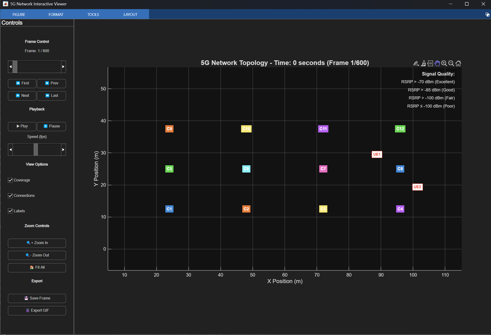

# Template cho thí sinh

## Cấu trúc thư mục cung cấp cho thí sinh

```
app/
    energy_agent/  # Thư mục chứa RL Agent của thí sinh
        actor.py (tùy chọn)
        critic.py (tùy chọn)
        rl_agent.py  # File chính để thí sinh điều chỉnh
        state_normalizer.py  # File để chuẩn hóa state đầu vào cho RL Agent
    scenarios/  # Thư mục chứa các kịch bản mô phỏng
        indoor_hotspot.json
        dense_urban.json
        rural.json
        urban_macro.json (file này sẽ đưa vào 24h cuối)
    DOCKER_USAGE.md  # Hướng dẫn cài đặt môi trường sử dụng Docker
    Dockerfile  # File Docker để xây dựng môi trường
    docker-compose.yml  # File docker-compose để chạy dịch vụ
    requirements.txt  # Các thư viện cần thiết cho RL Agent
    main_run_scenarios # File để chạy mô phỏng và xuất file energies.txt
    run_main_run_scenarios.sh # Script để chạy main_run_scenarios
    runSimulationWithAnimation # File để chạy mô phỏng với animation (sử dụng được trên Linux nếu có giao diện đồ họa)
    run_runSimulationWithAnimation.sh # Script để chạy runSimulationWithAnimation
```

## Các file được điều chỉnh

### Folder EnergySaving/energy_agent

- `rl_agent.py`: File này đã được điều chỉnh để thêm các tham số khởi tạo
- `actor.py` (tùy chọn)
- `critic.py` (tùy chọn)

#### File rl_agent.py

Sử dụng file `rl_agent.py` đã được cung cấp sẵn

### Các hàm không được xóa để tương tác với mô phỏng

1. Hàm `get_action(self, state)`: Hàm này được sử dụng để lấy hành động từ mạng chính sách dựa trên trạng thái hiện tại. Nó không được xóa vì mô phỏng cần gọi hàm này để quyết định hành động tiếp theo của tác nhân. Đầu ra của hàm này phải là một mảng có kích thước bằng với số lượng cells trong mô phỏng (ví dụ: nếu có 5 cells, đầu ra phải là mảng có 5 phần tử).

2. Hàm `update(self, state, action, reward, next_state, done)`: Hàm này được sử dụng để cập nhật tác nhân với kinh nghiệm mới thu thập được từ môi trường. Nó không được xóa vì mô phỏng cần gọi hàm này để cung cấp phản hồi cho tác nhân dựa trên hành động đã thực hiện.

3. Class `RLAgent`: sử dụng class này làm base để giao tiếp với mô phỏng. Không đổi tên hoặc xóa class này để đảm bảo tính tương thích với mô phỏng.

#### File state_normalizer.py

File này được sử dụng để chuẩn hóa state đầu vào cho RL Agent. Có thể điều chỉnh dựa vào yêu cầu kịch bản cho phù hợp thích ứng với mọi loại kịch bản được cung cấp.

### Các kịch bản ở folder scenarios

- Điều chỉnh các tham số để phục vụ cho việc huấn luyện RL Agent

## Mô tả các kịch bản

File `scenario.md`

## Hướng dẫn cài đặt môi trường sử dụng Docker

Trong folder `app/DOCKER_USAGE.md`

## Hướng dẫn chạy mô phỏng với RL Agent

### runSimulationWithAnimation.m

File này được sử dụng để chạy mô phỏng với animation (sử dụng được trên Linux nếu có giao diện đồ họa)



### main_run_scenarios.m

Sử dụng file này để chạy ra file energies.txt cho 4 kịch bản, nộp file này cùng với folder `energy_agent/` để được chấm điểm trên leaderboard.

## State được cung cấp cho RL Agent

State được cung cấp cho RL Agent là một dictionary với các thông tin sau:

## Yêu cầu format action trả về cho mô phỏng

Hành động trả về là một mảng numpy có kích thước bằng với số lượng cells trong mô phỏng. Mỗi phần tử trong mảng đại diện cho mức công suất truyền (txPower) của một cell cụ thể. Ví dụ, nếu có 5 cells trong mô phỏng, hành động trả về sẽ là một mảng có 5 phần tử, mỗi phần tử là giá trị txPower cho cell tương ứng. Ở đây giá trị truyền là tỉ số (powerRatio) so với công suất tối đa (maxTxPower) và công suất tối thiểu (minTxPower) của cell đó. Ví dụ, nếu cell có maxTxPower là 20 dBm và minTxPower là 10 dBm, thì giá trị powerRatio là 0.5 sẽ tương ứng với txPower `0.5*(20 - 10) + 10 = 15 dBm`.

## Tổng kết yêu cầu về RL Agent cho thí sinh

1. Xây dựng policy để đưa ra action cho môi trường mạng dựa trên state đầu vào
2. Xây dựng hàm reward để tối ưu hóa mục tiêu năng lượng và chất lượng dịch vụ
3. Xây dựng hàm update phù hợp với thuật toán RL đã chọn

## Về các file log để theo dõi quá trình mô phỏng

Ngoài theo dõi trên console hoặc qua animation, các log cần thiết sẽ được lưu vào các file sau:

1. `{timestamp}_agent.log`: File log của RL Agent, chứa action đã thực hiện tương ứng với timeStep trong mô phỏng
2. `{timestamp}_ue.log`: File log của các UE, chứa thông tin về các sự kiện rớt cuộc gọi và bị ngắt kết nối (nếu có)
3. `{timestamp}_handover.log`: File log của các sự kiện handover (nếu có)
4. `{timestamp}_energy_saving.log`: Chứa thông tin chạy mô phỏng, bao gồm thời gian hiện tại, tổng năng lượng tiêu thụ tới thời điểm hiện tại, công suất trung bình hiện tại và tỷ lệ rớt cuộc gọi trung bình.

## Về các KPI để đánh giá agent

Nhằm mục tiêu giảm năng lượng tiêu thụ trong khi vẫn duy trì chất lượng dịch vụ, các KPI chính để đánh giá hiệu suất của RL Agent bao gồm:

- **Tỉ lệ rớt cuộc gọi (Call Drop Rate)**: Tỷ lệ phần trăm các cuộc gọi bị rớt trong tổng số cuộc gọi được thực hiện.
- **Độ trễ trung bình (Latency)**: Thời gian trung bình từ khi một UE gửi yêu cầu đến khi nhận được phản hồi.
- **Traffic Load**: dựa vào CPU, PRB load của các cell

Mỗi kịch bản có các threshold riêng cho các KPI này, thí sinh cần đảm bảo rằng các KPI này không vượt quá ngưỡng cho phép trong quá trình huấn luyện và đánh giá agent. Cứ mỗi 10 giây mô phỏng (10 timeStep), kiểm tra các KPI này và sẽ tính số lần vi phạm vào cuối mô phỏng, vi phạm bất kì KPI nào cũng sẽ bị tính là 0 điểm cho kịch bản đó.